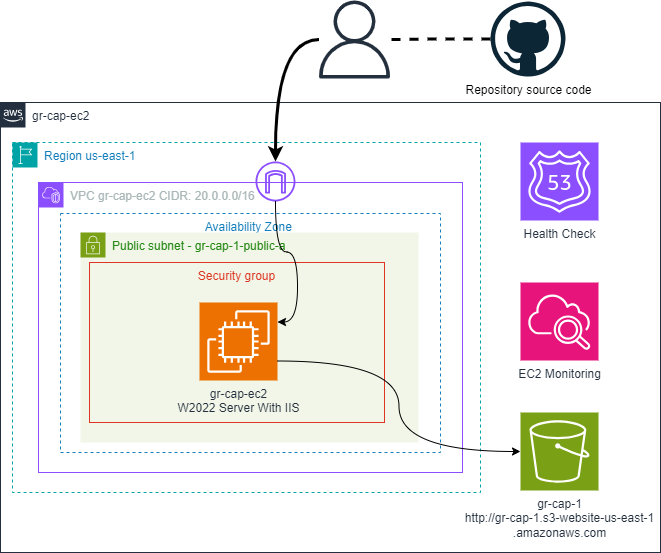

# Vodafone’s Modernization Journey to AWS

### Course-end Project 1

Description

In this project, you will design an application running three interlinked microservices, design the infrastructure in the cloud, and implement an AWS Architecture for Vodafone’s digital services. The architecture will support the company’s digital initiatives, such as its mobile and internet services, and provide a scalable, reliable, and secure platform for its customers. You will use AWS Services such as Amazon EC2, Amazon ECS, Amazon IAM, Amazon Elastic Load balancer, AWS systems manager, AWS Certificate Manager, AWS Amplify, AWS ECR, AWS CodeCommit, AWS CodeDeploy, AWS CodePipeline, AWS CloudWatch, AWS S3, AWS Cloudfront, AWS Fargate, AWS Copilot, AWS Inspector, AWS VPC, AWS FireLens, and Cloud9 as some of the services. (Not all services may be used necessarily. It's up to learners to choose a combination of services and design the solutio

 

